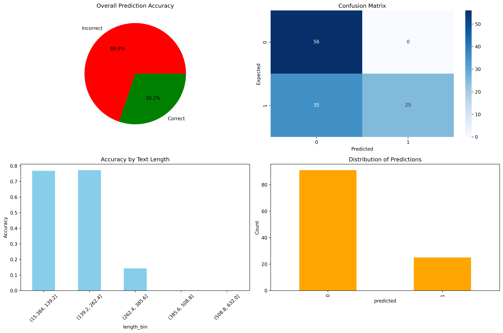

# 🛡️ LLM Safeguard

<div align="center">


*A robust defense system against prompt injection attacks and data leaks for local LLM interactions*

</div>

---

## 🎯 Overview

This project is designed to counter **prompt injection** and **data leaks** on a local command line interface with a chatbot. It acts as a security layer between users and language models, ensuring safe and controlled interactions.

## 🏗️ Architecture

The system is built with a **3-tier architecture** for maximum security and modularity:

```
┌─────────────┐    ┌─────────────┐    ┌─────────────┐
│     UI      │◄──►│    Proxy    │◄──►│    Model    │
│  Interface  │    │  Security   │    │   ChatBot   │
│   Layer     │    │    Layer    │    │             │
└─────────────┘    └─────────────┘    └─────────────┘
```

### 🖥️ **UI Layer**
- **Purpose**: Command-line interface for user interaction
- **Features**: Clean, intuitive chat interface
- **Technology**: Python CLI

### 🔒 **Proxy Layer** 
- **Purpose**: Security checkpoint for all communications
- **Features**: 
  - Real-time prompt injection detection
  - Input/output filtering
  - Data leak prevention
- **Technology**: Advanced ML models


### 🤖 **Model Layer**
- **Purpose**: Core chatbot functionality
- **Features**: Natural language processing and response generation
- **Technology**: Local LLM integration

### ⭐ Comments

However here there is no points in having a dataleaks security layer. Indeed, if it was an agent capable of accessing undesirable datas, then it would be a great feature to add. 

In this case there is much to do, etheir encrypt sensitive datas, filter the ouput,...
Here are some ressources about that : 
- [output filtering and content moderation](https://apxml.com/courses/intro-llm-red-teaming/chapter-5-defenses-mitigation-strategies-llms/output-filtering-content-moderation)
- [OWASP Top ten](https://genai.owasp.org/llmrisk/llm022025-sensitive-information-disclosure/) (highly recommand checking all the top 10)

---

## 🧠 Analyze Model

We utilize the state-of-the-art **[DeBERTa Prompt Injection Model by ProtectAI](https://huggingface.co/protectai/deberta-v3-base-prompt-injection)** for threat detection.

### 📊 Model Performance

| Metric | Score |
|--------|-------|
| **Accuracy** | 99.99% |
| **Recall** | 99.97% |
| **Precision** | 99.98% |
| **F1 Score** | 99.98% |
| **Loss** | 0.0010 |

### 🔬 Model Details

- **Base Model**: `microsoft/deberta-v3-base`
- **Fine-tuned by**: Laiyer.ai
- **Language**: English
- **License**: Apache 2.0
- **Classification**: 
  - `0` → No injection detected ✅
  - `1` → Injection detected ⚠️

---

## 🧪 Testing & Validation

We rigorously test our security model using the **[deepset/prompt-injection dataset](https://huggingface.co/datasets/deepset/prompt-injections)**.

### 📈 Test Results Visualization

<!-- Example of how to add an image -->

*Visualization of model performance on test dataset*

### ⚠️ Limitations

While LLM Safeguard provides robust protection against prompt injection and data leaks, it may not catch every novel or highly sophisticated attack. Continuous updates and monitoring are recommended to maintain optimal security.

Here what  we can see is that we used a DeBERTa Model, and it has been trained mainly on english prompt, making it robust against english prompt injections. But vulnerable to attacks of differents languages or mix of languages.

As we can see in the test results is that most of the model failed evaluations are due to German prompts, if we want more security etheir we train our model on all different languages or we separate the usecases. For example it may be very vulnerable to morse code injection.

---

## 🚀 Quick Start

```bash
# Clone the repository
git clone https://github.com/yourusername/llm-safeguard.git
cd llm-safeguard

# Install dependencies
pip install -r requirements.txt

# Run the application
python src/main.py
```

---

## 📁 Project Structure

```
llm-safeguard/
├── 📁 src/
│   ├── 📁 UI/          # User interface components
│   ├── 📁 proxy/       # Security proxy layer
│   ├── 📁 model/       # LLM integration
│   └── 📁 tests/       # Test suites
├── 📁 docs/          # Documentation images
├── 📄 README.md
└── 📄 requirements.txt
```

---


---

<div align="center">

**⭐ Star this repo if you find it helpful!**

Made with ❤️ for AI Safety

</div>


